# [Toy Project] 화장실 찾기 서비스

## 개요
* 공공 데이터를 이용한 간단한 길찾기 서비스 구현

## 요구사항 정의
* Version 1
  * 화장실 현황 공공 데이터는 위, 경도의 위치 정보 데이터를 가지고 있음
  * 해당 서비스로 **주소 정보를 입력하여 요청**하면 위치 기준에서 **가까운 화장실 3곳을 추출**
  * 주소는 도로명 주소 또는 지번을 입력하여 요청 받음
    * 정확한 주소를 입력 받기 위해 [Kakao 우편번호 서비스](https://postcode.map.daum.net/guide) 사용
  * 주소는 정확한 상세 주소(동, 호수)를 제외한 주소 정보를 이용하여 추천
    * ex) 서울 성북구 종암로 10길
  * 입력 받은 주소를 위도, 경도로 변환 하여 기존 약국 데이터와 비교 및 가까운 약국을 찾음 
    * 지구는 평면이 아니기 때문에, **구면에서 두 점 사이의 최단 거리 구하는 공식**이 필요
    * **두 위, 경도 좌표 사이의 거리를 [haversine formula](https://en.wikipedia.org/wiki/Haversine_formula)로 계산**
    * 지구가 완전한 구형이 아니므로 아주 조금의 오차가 있음 
  * 입력한 주소 정보에서 정해진 반경(10km) 내에 있는 화장실 추천**
  * 추출한 화장실 데이터는 **길안내 URL** 및 **로드뷰 URL**로 제공 
  * 길안내 URL은 고객에게 제공 되기 때문에 **가독성을 위해 shorten url로 제공**
  * shorten url에 사용 되는 key값은 인코딩하여 제공 
    * ex) http://localhost:8080/direction/nqxtX
    * base64를 통한 인코딩 
  * shorten url의 유효 기간은 30일로 제한

## Service 흐름 및 System 안내
* Version 1



## 개발 환경
* Intellij IDEA Ultimate
* Java 17
* Gradle 7.6.1
* Spring Boot 2.7.10

## 기술 세부 스택
* Spring Web
* Spring Configuration Processor
* Spring Data JPA
* QueryDSL 5.0.0
* MariaDB
* Redis
* Lombok

그 외
* Testcontainers
* Handlebars
* Spock
* Docker
* AWS EC2/RDS
* Kakao API(주소검색, 지도)

## Package Design
```
  └── src
    ├── main
    │   ├── java
    │   │     └── com.service.toiletfinder
    │   │            ├── ToiletFinderApplication(C)
    
    
    │   └── resources
    │       ├── static           
    
    │       ├── templates
               
    │       └── application.yaml
    ├── test
    │   ├── java
    │   │     └── com.service.toiletfinder
    │   │            ├── ToiletFinderApplicationTests(C)
    
    │   └── resources
    │       └── application.yaml
```